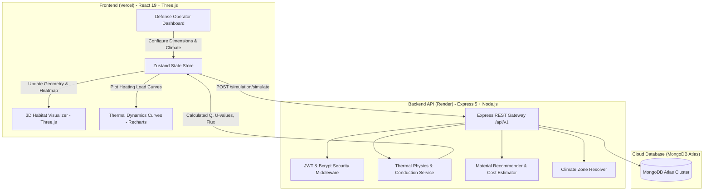

# ShelterX 🏔️ | DRDO Extreme Climate Habitat Defense Engine

> **Live Deployment:** [https://shelterx-drdo.vercel.app](https://shelterx-drdo.vercel.app)  
> *Production-grade thermal physics simulation, 3D interactive habitat design, and material cost optimization for high-altitude defense frontiers.*

[](https://shelterx-drdo.vercel.app)
[](https://react.dev/)
[](https://www.typescriptlang.org/)
[](https://threejs.org/)
[](https://nodejs.org/)
[](https://expressjs.com/)
[](https://www.mongodb.com/atlas)
[](https://tailwindcss.com/)

---

## 📌 Overview

**ShelterX** is a full-stack engineering simulation engine designed for extreme climate habitats across India's defense outposts (such as **Siachen Glacier, Ladakh, Leh, Dras, and Tawang**). 

The platform bridges thermodynamic structural engineering with interactive 3D computing. It allows defense engineers and habitat operators to model shelter dimensions, analyze exterior-to-interior thermal gradient transitions, evaluate advanced insulation materials, compute energy loads ($Q$), and generate transparent Bills of Materials (BOM) with real-world cost projections.

---

## 🚀 Key Features

### 1. 🧮 ANSYS-Validated Thermodynamic Physics
- **Fourier's Conduction Engine**: Computes steady-state conduction through composite wall and roof envelopes using:
  $$\Delta T = T_{\text{target}} - T_{\text{outside}}$$
  $$U_{\text{wall}} = \frac{k}{d_{\text{wall}}}, \quad U_{\text{roof}} = \frac{k}{d_{\text{roof}}}$$
  $$Q_{\text{total}} = U_{\text{wall}} \cdot A_{\text{wall}} \cdot \Delta T + U_{\text{roof}} \cdot A_{\text{roof}} \cdot \Delta T$$
- Validated against empirical finite-element **ANSYS conduction benchmarks**.
- Calculates heating/cooling energy demand ($\text{kW}$ and $\text{W/m}^2$ heat flux).

### 2. 🧊 Interactive 3D Habitat Visualizer
- Powered by **Three.js** and **React Three Fiber (@react-three/fiber)**.
- **Dynamic Dimension Morphing**: Real-time 3D scaling based on custom length, width, and height inputs.
- **Interior Inspection & Thermal Color Gradient**: Real-time visual feedback mapping cold exterior vs. insulated warm interior.
- Interactive camera controls with orbit rotation, pan, zoom, and lighting physics.

### 3. 🗺️ High-Altitude Climate Zone Adaptation
- Specialized meteorological presets and dynamic weather ingestion for harsh high-altitude sub-zero sectors:
  - **Siachen Base Camp** (down to $-40^\circ\text{C}$)
  - **Leh & Ladakh** (high diurnal temperature swings)
  - **Dras / Kargil** (severe wind chill and extreme cold)
  - **Tawang / North-East Frontiers** (high humidity cold zones)

### 4. 🧱 Advanced Material Recommendation Engine
- Database of tested military and aerospace insulation composites:
  - **Aerogel Blankets** ($k \approx 0.015\text{ W/m}\cdot\text{K}$)
  - **Vacuum Insulation Panels (VIP)** ($k \approx 0.007\text{ W/m}\cdot\text{K}$)
  - **Polyurethane Rigid Foam (PUR/PIR)**
  - **Expanded & Extruded Polystyrene (EPS/XPS)**
  - **Rockwool & Glass Wool Core Sandwich Panels**
- Calculates optimum thickness to balance thermal retention vs. internal payload volume.

### 5. 💰 Bill of Materials (BOM) & Cost Estimator
- Instant surface area calculations ($A_{\text{wall}} = 2(L \cdot H + W \cdot H)$, $A_{\text{roof}} = L \cdot W$).
- Material cost, logistics and installation overhead, GST breakdown, and automated budget compliance indicators.

### 6. 📊 Real-Time Load Curves & Analytics
- Visualized with **Recharts**.
- Heating requirements graphed across 24-hour diurnal outdoor temperature sweeps.

### 7. 🔐 Military Operator Access & Persistence
- Secure role-based operator authentication using **JWT** and salted **bcryptjs** hashing.
- Saves custom simulation configurations and historical runs to **MongoDB Atlas**.

---

## 🏗️ Architecture & Data Flow



---

## 💻 Tech Stack

| Domain | Technology | Description |
|---|---|---|
| **Frontend Framework** | React 19.2 + TypeScript | Modern declarative UI with Strict Mode |
| **Bundler & Tooling** | Vite 8.2 | Instant HMR and optimized production bundling |
| **3D Rendering** | Three.js + React Three Fiber + Drei | WebGL 3D habitat geometry and shaders |
| **Styling** | Tailwind CSS v4 + Geist Font | High-contrast military-grade UI aesthetics |
| **Visual Charts** | Recharts 3.10 | Responsive thermal gradient curves |
| **State Management** | Zustand 5.0 | Lightweight reactive state store |
| **Backend Runtime** | Node.js 20+ (ES Modules) | High-performance asynchronous runtime |
| **Server Framework** | Express 5.2 | Fast RESTful API framework |
| **Database** | MongoDB Atlas + Mongoose 9.9 | Cloud NoSQL schema and document store |
| **Security & Auth** | JSON Web Tokens (JWT) + BcryptJS | Cryptographic tokens & hashed credentials |
| **Frontend Hosting** | Vercel | Global edge CDN deployment |
| **Backend Hosting** | Render | Managed cloud web service with auto-scaling |

---

## 📂 Repository Structure

```text
ShelterX/
├── backend/                         # Express API & Thermal Physics Engine
│   ├── config/                      # MongoDB Atlas connection & environment setup
│   ├── controllers/                 # Request handlers (auth, simulation, materials)
│   ├── data/                        # Verified materials & climate zone datasets
│   ├── middleware/                  # JWT auth, rate limiting, and error handlers
│   ├── models/                      # Mongoose schemas (User, Simulation, Climate)
│   ├── routes/                      # REST endpoints (/api/v1/...)
│   ├── services/                    # ANSYS thermal physics, material & cost logic
│   │   ├── thermalPhysicsService.js # Steady-state conduction (Fourier's law)
│   │   ├── materialRecommendationService.js # Thermal optimization algorithms
│   │   ├── costService.js           # BOM generation and GST/installation estimation
│   │   └── weatherService.js        # Extreme climate temperature ingestion
│   ├── tests/                       # Unit & integration tests (Node Test Runner)
│   ├── package.json                 # Backend dependencies & scripts
│   └── server.js                    # Express application entrypoint
│
├── frontend/                        # React 19 + Three.js SPA
│   ├── src/
│   │   ├── components/              # Reusable UI components (Navbar, Cards, Badges)
│   │   ├── features/
│   │   │   ├── simulator/           # 3D canvas, controls, and parameter forms
│   │   │   └── visualizer/          # Heat flux visualizers & material selectors
│   │   ├── pages/                   # Dashboard, Simulation Studio, Auth Pages
│   │   ├── services/                # Axios API client with dynamic URL resolver
│   │   └── store/                   # Zustand stores for simulation parameters
│   ├── package.json                 # Frontend dependencies & scripts
│   └── vite.config.ts               # Vite configuration with Tailwind CSS v4
│
├── render.yaml                      # Infrastructure-as-code for Render deployment
├── vercel.json                      # Single Page Application rewrite rules for Vercel
└── README.md                        # Master project documentation
```

---

## 🛠️ Local Development Setup

### 1. Clone Repository
```bash
git clone https://github.com/rishipatel83/ShelterX.git
cd ShelterX
```

### 2. Backend Setup
```bash
cd backend
npm install
```

Create a `.env` file in the `backend/` directory:
```env
NODE_ENV=development
PORT=5000
MONGO_URI=your_mongodb_connection_string
JWT_SECRET=your_secret_cryptographic_key_here
CORS_ORIGINS=http://localhost:5173
TRUST_PROXY=0
```

Start the backend server:
```bash
# Production mode
npm start

# Or with live watch
npm run dev
```
Backend will be available at: `http://localhost:5000`  
Health check: `http://localhost:5000/api/v1/health`

### 3. Frontend Setup
In a new terminal window:
```bash
cd ../frontend
npm install
```

Create a `.env` file in the `frontend/` directory (optional for local):
```env
VITE_API_URL=http://localhost:5000/api/v1
```

Start the Vite development server:
```bash
npm run dev
```
Frontend will be available at: `http://localhost:5173`

---

## 🧪 Testing

The backend includes a comprehensive suite of physics validation and engineering boundary tests:

```bash
cd backend
npm test
```

### Verified Test Cases:
- Envelope surface area calculations for user dimensions
- Conduction heat flux ($Q$) reproduction against validated ANSYS cases
- Temperature gradient inversion handling (cooling vs. heating direction)
- Climate zone coordinate and elevation mapping
- Boundary condition validation (rejecting negative thicknesses and invalid physics)
- Material recommendation specificity across extreme cold outposts

---

## 🌐 API Reference

### Health & Monitoring
| Method | Endpoint | Description |
|---|---|---|
| `GET` | `/` | Root service ping |
| `GET` | `/health` | Container health probe |
| `GET` | `/api/v1/health` | Comprehensive API status and engine metadata |
| `GET` | `/api/v1/ready` | Database readiness check (`connected`/`disconnected`) |

### Core Services
| Method | Endpoint | Description |
|---|---|---|
| `POST` | `/api/v1/simulation/simulate` | Runs full thermodynamic conduction, load, & BOM calculation |
| `GET` | `/api/v1/materials` | Retrieves certified insulation materials and $k$-values |
| `POST` | `/api/v1/auth/register` | Registers a new operator account |
| `POST` | `/api/v1/auth/login` | Authenticates operator and returns JWT bearer token |

---

## 🚀 Deployment Guide

| Component | Platform | URL / Configuration |
|---|---|---|
| **Frontend** | **Vercel** | [https://shelterx-drdo.vercel.app](https://shelterx-drdo.vercel.app) |
| **Backend** | **Render** | Root Directory: `backend`, Command: `npm start` |
| **Database** | **MongoDB Atlas** | High-availability cloud replica set |

---

## 📄 License & Intellectual Property

Developed for **DRDO Extreme Climate Defense Applications**.  
All rights reserved © 2026 ShelterX Engineering Team.
